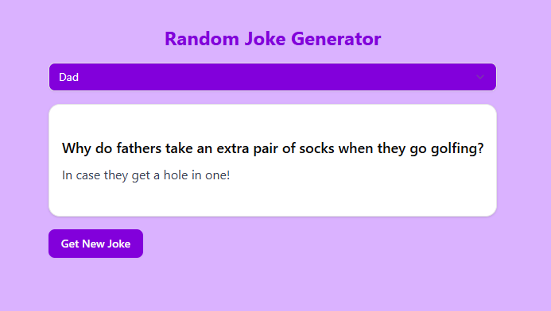

# Overview



---

This is a react based project and task from [tapaScript](https://youtu.be/fPBW7Pn6O38?si=NU0Ac9njxhBSBf7q) youtube chanel. [Tapas Adhikari](https://x.com/tapasadhikary) is an amazing tutor who is passionate to teach web development. He exlpain in depth and want to get feedback form given task.This is mainly simple react applicaton that include a parents part Random joke generator and other three categoris general, dad and knock-knock.

# Tool and Technology

---

1. Tool

- VS Code
- Vite
- git

2. Technology

- Javascript
- React
- Tailwind CSS
- HTML
- Shadcn/ui

# Challenges

---

There is copule of challenges that I have faced to implement this project. Some of these are to control data flow one component to another. Beside the data structure implementation is more hard challenge for me in this contex. I have faced some logic build obstacle to complete this task.

# Deployment

---

This is a fontend application, so my best deployment option is vercel.

- code deploy on github.
- project deploy on vercel.

# how to run this Project

---

step-1:

go to terminal and write this command to clone source code

```
git clone https://github.com/khabbab50/tapaScriptJokeGenerator.git
```

step-2:

to go the project repository write

```
cd jokeGenerator
```

step-3:

to install dependencies write

```
npm install
```

step-4:

to run the code write

```
npm run dev
```

---

source code: [github link](https://github.com/khabbab50/tapaScriptJokeGenerator.git)

---

live project: [vercel deployment link](https://tapa-script-joke-generator.vercel.app/)
